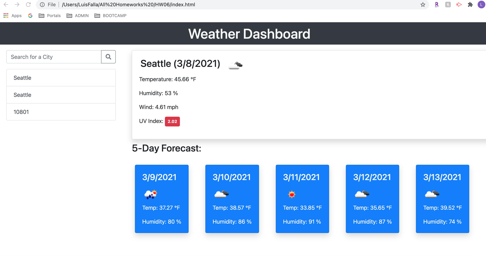

# Homework 06 - Weather Dashboard

## Link to site
* [Live Link](https://chronoslou.github.io/HW06/) 
* [Repo Link](https://github.com/chronoslou/HW06) 

## Description

This is a Weather APP leveraging the OpenWeather API to retrieve weather data for cities. This will assist travelers with weather related inquiries. This app can be used for multiple cities so that travelers can plan their trips accordingly. 

## Usage/Acceptance Criteria

The app will perfom the following logic:

* The app will display a weather dashboard.
* The app will accept traveler's queries to search for cities. 
* Upon search, the app will provide results based on queries 
* The app's search result will presented traveler's with current and future conditions for that city 
* The app will allow the traverler to add to the search history
* The app will display current weather conditions for that city
* The app will show city name, the date, an icon representation of weather conditions, the temperature, the humidity, the wind speed, and the UV index
* The UV index will show a color that indicates whether the conditions are favorable, moderate, or severe
* The app will show the predicted forecast for 5 days and will display the date, an icon representation of weather conditions, the temperature, and the humidity
* When the traveler clicks on a city in the search history then they are presented with current and future conditions for that city

## Preview of App 

* This is how the app looks

# Lincense
* MIT

